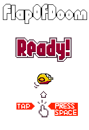

# 🎮 FlapOfDoom

FlapOfDoom ist eine moderne und erweiterte Version des klassischen Flappy Bird Spiels, entwickelt in Python mit Pygame. Das Spiel bietet ein umfangreiches Shop-System, verschiedene Charaktere, Tag/Nacht-Wechsel und ein innovatives Münzsystem.



## 📋 Inhaltsverzeichnis
- [Features](#-features)
- [Installation](#-installation)
  - [Installation über Setup](#installation-über-setup)
  - [Installation von CD](#installation-von-cd)
  - [Manuelle Installation](#manuelle-installation)
- [Spielanleitung](#-spielanleitung)
- [Shop-System](#-shop-system)
- [Münzsystem](#-münzsystem)
- [Highscore-System](#-highscore-system)
- [Technische Details](#-technische-details)
- [Fehlerbehebung](#-fehlerbehebung)
- [Support](#-support)

## 🌟 Features

### Grundfunktionen
- Klassisches Flappy Bird Gameplay mit modernen Elementen
- Hochwertige Grafiken und flüssige Animationen
- Integriertes Shop-System mit Freischaltbaren Inhalten
- Online-Highscore-System
- Automatische Speicherung des Fortschritts

### Anpassungsmöglichkeiten
- **Vogel-Charaktere:**
  - Standard-Vogel (kostenlos)
  - Blauer Eisvogel
  - Roter Phönix
  - Goldener Blitz
- **Hintergründe:**
  - Sonniger Tag
  - Sternenklare Nacht
  - Mystische Mitternacht
- **Partikeleffekte:**
  - Sternenstaub
  - Eisaura
  - Feuerspur
  - Magische Essenz

## 💿 Installation

### Installation über Setup
1. Führen Sie `FlapOfDoom_Setup.exe` aus
2. Wählen Sie die gewünschte Installationssprache
3. Folgen Sie den Anweisungen des Installationsassistenten
4. Optional: Erstellen Sie eine Desktop-Verknüpfung
5. Nach der Installation kann das Spiel über das Startmenü oder die Desktop-Verknüpfung gestartet werden

### Installation von CD
1. Legen Sie die FlapOfDoom-CD ein
2. Wenn AutoPlay aktiviert ist:
   - Wählen Sie "FlapOfDoom installieren" im AutoPlay-Fenster
   - Folgen Sie den Installationsanweisungen
3. Wenn AutoPlay deaktiviert ist:
   - Öffnen Sie den CD-Inhalt manuell
   - Starten Sie `FlapOfDoom_Setup.exe`
   - Folgen Sie den Installationsanweisungen

### Manuelle Installation
Für Entwickler und fortgeschrittene Benutzer:
1. Installieren Sie Python 3.6 oder höher
2. Installieren Sie die erforderlichen Pakete:
```bash
pip install pygame
pip install pillow
```
3. Klonen Sie das Repository oder laden Sie den Quellcode herunter
4. Starten Sie das Spiel mit:
```bash
python flappy.py
```

## 🎮 Spielanleitung

### Steuerung
- **Springen:** 
  - Leertaste
  - Pfeiltaste nach oben
  - Linke Maustaste
- **Pause:** ESC-Taste
- **Menü-Navigation:** 
  - Maus
  - Pfeiltasten + Enter
- **Shop:** S-Taste
- **Zurück zum Hauptmenü:** M-Taste (im Pause-Menü)

### Spielablauf
1. Wählen Sie im Hauptmenü "Spielen"
2. Steuern Sie den Vogel durch die Hindernisse
3. Sammeln Sie Münzen für den Shop
4. Bei Kollision: Game Over und Highscore-Eintrag

## 🛍️ Shop-System

### Vogel-Skins
| Skin | Preis | Beschreibung | Voraussetzung |
|------|-------|--------------|---------------|
| Standard | Kostenlos | Klassischer Vogel | - |
| Blau | 215 | Eiskalter Flieger | - |
| Rot | 390 | Feuriger Phönix | - |
| Gelb | 560 | Goldener Blitz | - |

### Hintergründe
| Hintergrund | Preis | Beschreibung |
|-------------|-------|--------------|
| Tag | Kostenlos | Sonniger Himmel |
| Nacht | 500 | Sternenklarer Himmel |
| Mitternacht | 1250 | Mystische Atmosphäre |

### Partikeleffekte
| Effekt | Preis | Beschreibung | Voraussetzungen |
|--------|-------|--------------|-----------------|
| Standard | Kostenlos | Keine Partikel | - |
| Sternenstaub | 250 | Gelbe Sterne | Alle Vogel-Skins |
| Eisaura | 325 | Blaue Kristalle | Sternenstaub + Nacht |
| Feuerspur | 650 | Rote Flammen | Eisaura + Mitternacht |
| Magie | 850 | Violette Energie | Alle anderen Effekte |

## 💰 Münzsystem
- **Verdienen:**
  - 5 Münzen pro passiertem Hindernis
  - Bonus-Münzen durch Easter Eggs
  - Konami-Code (↑↑↓↓←→←→BA): 1000 Münzen
- **Ausgeben:**
  - Neue Charaktere
  - Hintergründe
  - Partikeleffekte

## 🏆 Highscore-System

### Online-System
- Automatische Übertragung an den Server
- Einsehbar unter: https://api.magrora.de/flapofdoom
- Benötigt Internetverbindung

### Offline-System
- Lokale Speicherung in `highscores.json`
- Automatische Synchronisation bei Internetverbindung
- HTML-Ansicht der lokalen Bestenliste

## 🔧 Technische Details

### Systemanforderungen
- Windows 7/8/10/11
- 2GB RAM
- 100MB freier Speicherplatz
- Internetverbindung (optional, für Online-Features)

### Dateisystem
- `flappy.py`: Hauptspieldatei
- `assets/`: Verzeichnis für Grafiken, Audio und Video
  - `sprites/`: Spielgrafiken
  - `audio/`: Soundeffekte
  - `video/`: Videosequenzen

### Speichersystem
- Spielerdaten werden in `player_data.json` gespeichert
- Lokale Highscores in `highscores.json`
- Automatische Speicherung von:
  - Münzen
  - Freigeschalteten Skins
  - Aktuell ausgewähltem Skin
  - Highscores

## 🐛 Bekannte Probleme

- Bei sehr hohen Bildschirmauflösungen können Grafikfehler auftreten
- Online-Highscores benötigen eine aktive Internetverbindung

## 📝 Lizenz

Dieses Projekt steht unter der MIT-Lizenz. Siehe [LICENSE](LICENSE) für weitere Details.

## 👥 Mitwirkende

- Entwickler
- Designer
- Tester

## 📞 Support

Bei Fragen oder Problemen:
- Erstelle ein Issue auf GitHub
- Kontaktiere uns über [Website/Email]

---
Entwickelt mit ❤️ und Python

